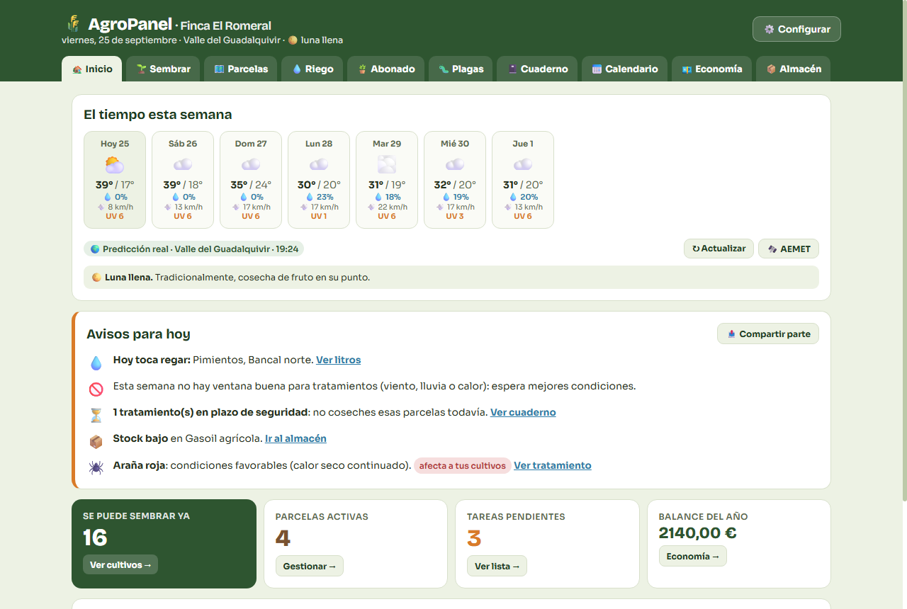
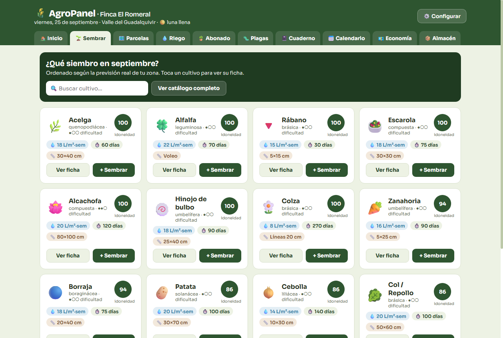
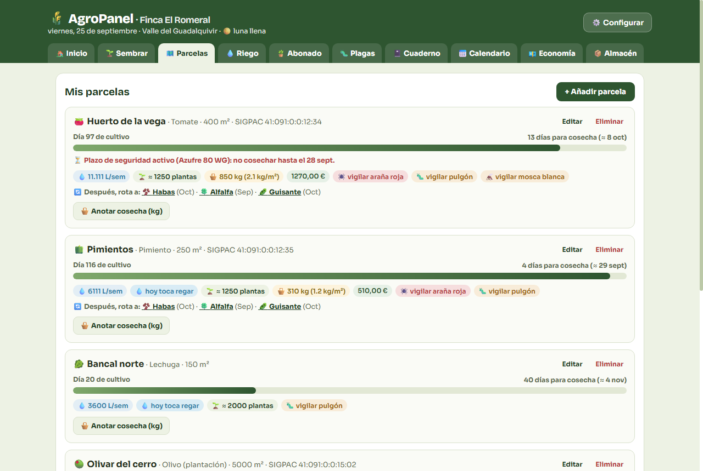
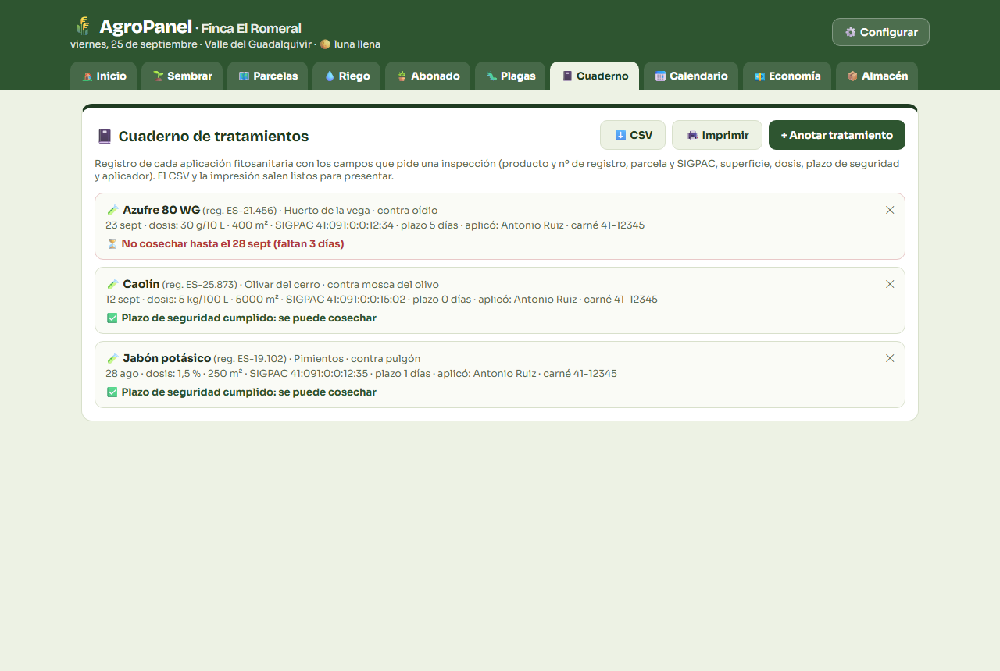
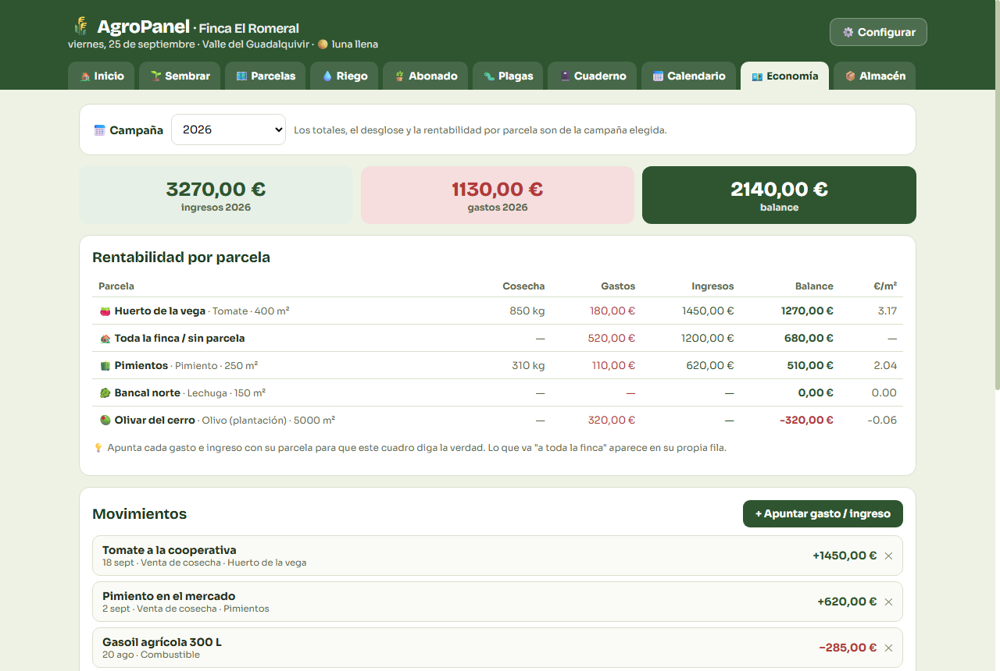
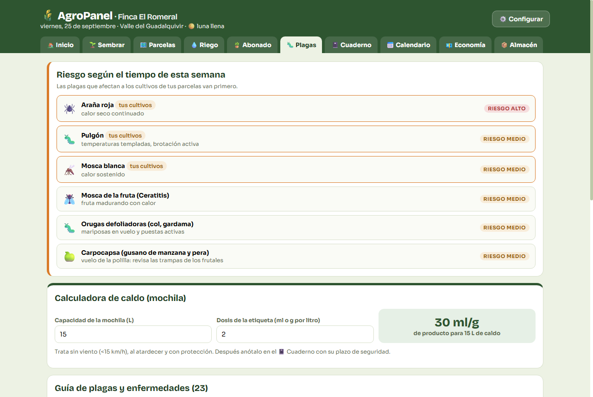
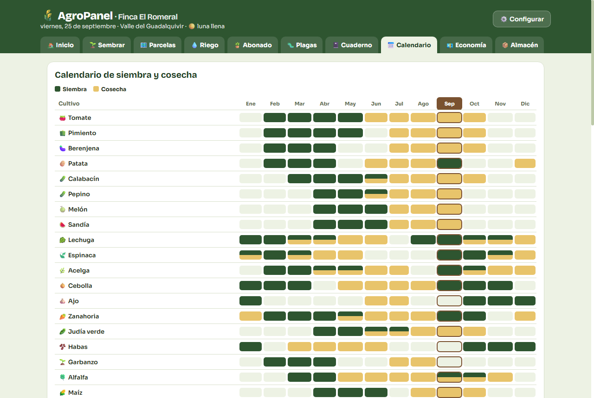

# 🌾 AgroPanel

**El panel de control de tu finca.** Todo lo que necesitas cada día en el campo,
en una sola pantalla: el tiempo, qué sembrar, cuándo regar, qué plagas vigilar, el cuaderno
de campo para la inspección y las cuentas de la campaña.

## Descargar (Windows 10 / 11)

| Versión | Enlace |
|---|---|
| **AgroPanel** (con clave de licencia) | [⬇️ AgroPanel-portable.exe](https://github.com/ladoempresa2022-lab/agropanel-descargas/releases/latest/download/AgroPanel-portable.exe) |
| **Prueba gratis 30 días** (sin clave) | [⬇️ AgroPanel-Prueba-30dias-portable.exe](https://github.com/ladoempresa2022-lab/agropanel-descargas/releases/latest/download/AgroPanel-Prueba-30dias-portable.exe) |

Los enlaces descargan siempre la **última versión**. No hay que instalar nada: se abre con doble clic.

---

## Qué puedes hacer con AgroPanel

### ☀️ Saber qué te espera esta semana
La predicción real a 7 días de tu zona (o la oficial de **AEMET** de tu municipio): temperaturas,
lluvia, viento y UV. Cada mañana te dice **qué toca hoy**: qué parcelas regar, si hay riesgo de
helada, el mejor día para tratar sin viento ni lluvia, qué plagas vigilar, qué se está acabando
en el almacén… Y con un botón copias el parte del día para mandarlo por WhatsApp.

### 🌱 Qué sembrar ahora
Más de 60 cultivos de huerta, cereal, leguminosas y frutales, ordenados según el tiempo que viene
en tu zona. Cada uno con su ficha: marco de plantación, agua, días hasta la cosecha, abonado,
plagas que le afectan y **con qué rotar después**.

### 🗺️ Tus parcelas, al día
Da de alta cada parcela (con su referencia SIGPAC) y AgroPanel lleva la cuenta: días de cultivo,
cuándo estará lista, **litros de riego de la semana** descontando la lluvia, plantas que caben,
kilos cosechados y si tiene un plazo de seguridad activo.

### 📓 Cuaderno de campo listo para la inspección
Anota cada tratamiento con los campos que pide la inspección: producto y nº de registro, parcela
y SIGPAC, superficie, dosis, plazo de seguridad y aplicador (con fotos si quieres). Te avisa de
**cuándo puedes volver a cosechar**, y lo sacas en **Excel** o impreso con un clic.

### 💶 ¿Sale a cuenta la campaña?
Apunta gastos (semilla, gasoil, abono, agua…) e ingresos (ventas, PAC) y mira el balance del año
y la **rentabilidad de cada parcela**, en euros por metro cuadrado.

### 🐛 Plagas y enfermedades
Según el tiempo de la semana, te dice qué plagas tienen condiciones favorables, **primero las que
afectan a tus cultivos**. Guía de 23 plagas con síntomas, tratamiento ecológico y químico, y
calculadora de caldo para la mochila.

### 📅 Y además
- **Calendario** de siembra y cosecha de todo el catálogo, y la luna de los próximos 14 días.
- **Calculadoras** de riego (goteo, aspersión, a manta) y de abonado.
- **Almacén** de semillas, fitosanitarios, abonos y gasoil, con aviso de stock bajo.
- **Maquinaria**: horas de trabajo y aviso de la próxima revisión.
- **Texto grande** para leer sin gafas, y deshacer si borras algo sin querer.

---

## La primera vez que lo abras

Windows puede mostrar **«Windows protegió su PC»**, porque el programa todavía no lleva
firma digital. Es normal:

1. Pulsa **«Más información»**.
2. Pulsa **«Ejecutar de todas formas»**.

Solo pasa la primera vez.

## Tus datos son tuyos

Todo se guarda en tu propio ordenador, no en internet, con una **copia de seguridad automática
cada día**. Desde ⚙️ Configurar puedes exportar una copia cuando quieras.

---

¿Quieres la versión completa? Descarga AgroPanel y actívalo con tu clave de licencia.

Las capturas muestran una finca de ejemplo.
